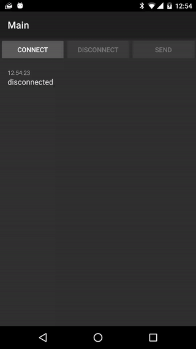

# JavaWebsocketClient also for Android
JavaWebsocketClient is library is simple library for Websocket connection in rx for java and Android.
It is designed to be fast and fault tolerant.

Currently we use okhttp3 for websocket connection because okhttp3 is simple and well tested solution.

[](https://travis-ci.org/jacek-marchwicki/JavaWebsocketClient)

[](https://jitpack.io/#jacek-marchwicki/JavaWebsocketClient)



## Content of the package

* Example websockets server [python twisted server](websockets-server/README.md)
* Rx-java websocket client library `websockets-rxjava/`
* Rx-java websocket android example `websockets-rxjava-example/`

## Reactive example

How to connect to server:

```java
final Request request = new Request.Builder()
        .get()
        .url("ws://10.10.0.2:8080/ws")
        .build();
final Subscription subscribe = new RxWebSockets(new OkHttpClient(), request)
        .webSocketObservable()
        .subscribe(new Action1<RxEvent>() {
            @Override
            public void call(RxEvent rxEvent) {
                System.out.println("Event: " + rxEvent.toString());
            }
        });
Thread.sleep(10000);
subscribe.unsubscribe();
```

Send message on connected:

```java
final Subscription subscription = new RxWebSockets(newWebSocket, request)
        .webSocketObservable()
        .subscribe(new Action1<RxEvent>() {
            @Override
            public void call(RxEvent rxEvent) {
                if (rxEvent instanceof RxEventConnected) {
                    Observable.just("response")
                            .compose(RxMoreObservables.sendMessage((RxEventConnected) rxEvent))
                            .subscribe();
                }
            }
        });
Thread.sleep(1000);
subscription.unsubscribe();
```

For examples look:
* Android example: [Activity](websockets-rxjava-example/src/main/java/com/appunite/socket/MainActivity.java) [Presenter](websockets-rxjava-example/src/main/java/com/appunite/socket/MainPresenter.java)
* Example Real tests: [RxJsonWebSocketsRealTest](websockets-rxjava-example/src/test/java/com/example/RxObjectWebSocketsRealTest.java), [RxWebSocketsRealTest](websockets-rxjava-example/src/test/java/com/example/RxWebSocketsRealTest.java), [SocketRealTest](websockets-rxjava-example/src/test/java/com/example/SocketRealTest.java)
* [Unit test](websockets-rxjava-example/src/test/java/com/example/SocketTest.java)

## Rx-java with json parser

```java
class YourMessage {
    public String response;
    public String error;
}

final Request request = new Request.Builder()
        .get()
        .url("ws://10.10.0.2:8080/ws")
        .build();
final RxWebSockets rxWebSockets = new RxWebSockets(new OkHttpClient(), request)
final ObjectSerializer serializer = new GsonObjectSerializer(new Gson(), Message.class)
final RxObjectWebSockets webSockets = new RxObjectWebSockets(rxWebSockets), serializer);
final Subscription subscription = webSockets.webSocketObservable()
        .compose(MoreObservables.filterAndMap(RxObjectEventMessage.class))
        .compose(RxObjectEventMessage.filterAndMap(YourMessage.class))
        .subscribe(new Action1<YourMessage>() {
            @Override
            public void call(YourMessage yourMessage) {
                System.out.println("your message: " + yourMessage.response);
            }
        });
Thread.sleep(1000);
subscription.unsubscribe();
```

## Run example from gradle

To run example first run [websocket server](websockets-server/README.md), than update url to your host in:
* [Rx-java Activity](websockets-rxjava-example/src/main/java/com/appunite/socket/MainActivity.java)

```bash
./gradlew :websockets-rxjava-example:installDebug
```

## How to add to your project

to your gradle file:

```groovy
repositories {
    maven { url "https://jitpack.io" }
}

dependencies {

    // snapshot version
    compile 'com.github.jacek-marchwicki:JavaWebsocketClient:master-SNAPSHOT'

    // or use specific version
    compile 'com.github.jacek-marchwicki:JavaWebsocketClient:<look-on-release-tab>'
}
```
		
## License

    Copyright [2015] [Jacek Marchwicki <jacek.marchwicki@gmail.com>]
    
    Licensed under the Apache License, Version 2.0 (the "License");
    you may not use this file except in compliance with the License.
    You may obtain a copy of the License at
    
    	http://www.apache.org/licenses/LICENSE-2.0
        
    
    Unless required by applicable law or agreed to in writing, software
    distributed under the License is distributed on an "AS IS" BASIS,
    WITHOUT WARRANTIES OR CONDITIONS OF ANY KIND, either express or implied.
    See the License for the specific language governing permissions and
    limitations under the License.
